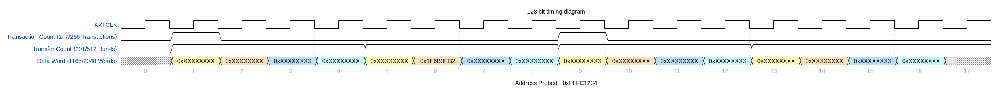

# Project Adv Embedded MCU: 
```
Name: Jatin Khare
UT EID: jk47976
Email: jatinkhare@utexas.edu

Name: Abhijjith Venkkateshraj
UT EID: av36677
Email: abhijjith@utexas.edu

```
## How to run the code

First, run the following command in the specified directories to setup the environment:

```bash

/your_path/project_sniffer/kernal_modules# source insert.sh       #this makes the kernel modules and inserts them in the kernel

/your_path/project_sniffer/codes# fpgautil -b project_bit_streams/128_2_disabled.bit        #to insert the bit file
#can also choose other bit files for different analysis.
```

Once you are in the 'project_sniffer/codes' directory and have the .c files (test1.c and sniffer_test1.c) in the same directory as the Makefile, do the following:

``` 
$ make clean
$ make  #This will generate the corresponding object files and executables for the test case.
$ ./test1
& ./sniffer_test1

```

## Running test1.c before sniffer_test1.c is must as it initializes all the counts before the sniffer starts probing.


### ./test1

USAGE:

```bash
root@ultra96:~/labs/advmcu_codes/advancesmcusystems/project_sniffer/codes# ./test1 
Default loop number = 500
PS Frequency: Enter number 0, 1, and 2 for setting PS Freq. to 1499 MHz, 999 MHz, and 416.6 MHz respectively.
For now, setting it to 1499 MHz..
PL Frequency: Enter number 0, 1, and 2 for setting PL Freq. to 250 MHz, 187.5 MHz, and 100 MHz respectively.
For now, setting it to 300 MHz..

DMA's OCM/BRAM traffic tests with 500 and 1024 words successful!!!

For OCM to BRAM:
Minimum Latency:    1227
Maximum Latency:    1342
Average Latency:    1231.000000
Standard Deviation: 26.000000
Number of samples:  500

For BRAM to OCM:
Minimum Latency:    1231
Maximum Latency:    4433
Average Latency:    1240.000000
Standard Deviation: 147.000000
Number of samples:  500
Total number of Interrupts for to-and-fro transfer: 1000


```
### ./sniffer_test1

USAGE:

```bash
root@ultra96:~/labs/advmcu_codes/advancesmcusystems/project_sniffer/codes# ./sniffer_test1 
Setting PS Freq. to 416.6 MHz
Setting PL Freq. to 187.5 MHz
Setting loop number = 1
Setting words per loop = 2048

Enter the read address to probe: 0xfffc1234
Enter the write address to probe: 0xfffc3234

Data Width = 128 bits, 
Burst Length = 2 transfers per transaction

read_probe address = xfffc1234, read_address_offset = x00001234, read_address_count = 291
write_probe address = xfffc3234, write_address_offset = x00001234, write_address_count = 291
read burst number in the transaction = 2, 
read word number in the transfer = 2

write burst number in the transaction = 2, 
write word number in the transfer = 2

factor = 16

DMA's OCM/BRAM traffic test with 1 loops and 2048 words successful!!!

For OCM to BRAM:
Minimum Latency:    2233
Maximum Latency:    2233
Average Latency:    2233.000000
Standard Deviation: 0.000000
Number of samples:  1

For BRAM to OCM:
Minimum Latency:    2187
Maximum Latency:    2187
Average Latency:    2187.000000
Standard Deviation: 0.000000
Number of samples:  1
Total number of Interrupts for to-and-fro transfer: 2

sniffer_reg[0] = xbead0141
sniffer_reg[1] = x00000123
sniffer_reg[2] = x00000002
sniffer_reg[3] = x00000123
sniffer_reg[4] = x0000001e
sniffer_reg[5] = x00000100
sniffer_reg[6] = x00000100
sniffer_reg[7] = x00000200
sniffer_reg[8] = x00000200
sniffer_reg[9] = x00000100
sniffer_reg[10] = x00000100
sniffer_reg[11] = x00000200
sniffer_reg[12] = x00000200
sniffer_reg[13] = xfeed0000
sniffer_reg[14] = x1e6b9eb2
sniffer_reg[15] = x1e6b9eb2

OCM1 to CDMA read transactions  = 256
OCM1 to CDMA read transfers     = 512

CDMA to BRAM write transactions = 256
CDMA to BRAM write transfers    = 512

BRAM to CDMA read transactions  = 256
BRAM to CDMA read transfers     = 512

CDMA to OCM2 write transactions = 256
CDMA to OCM2 write transfers    = 512

Transfer : Transaction Ratio    = 1:1


```

This will generate the timing_config.json file, which is used to visualize the timing diagram in [WaveDromEditor.](https://github.com/wavedrom/wavedrom)

Note: the timing_config.json supports 128 data bus width with a burst size of 2. So use this file and the WaveDromEditor only for 128_2_disabled.bit bistream. 


The timing diagram from WaveDromEditor is shown as:

<hr style="border:2px solid gray"> </hr>

The verilog code is found in the directory '/project_sniffer/verilog_codes/sniffer'.
The registers store the following details: 
```text
	        5'h00   : reg_data_out <= burst_info_reg;
	        5'h01   : reg_data_out <= slv_reg1;
	        5'h02   : reg_data_out <= slv_reg2;
	        5'h03   : reg_data_out <= slv_reg3;
	        5'h04   : reg_data_out <= slv_reg4;
	        5'h05   : reg_data_out <= f_read_access_count_ar;
	        5'h06   : reg_data_out <= f_write_access_count_aw;
	        5'h07   : reg_data_out <= f_read_access_count_r;
	        5'h08   : reg_data_out <= f_write_access_count_w;
	        5'h09   : reg_data_out <= b_read_access_count_ar;
	        5'h0A   : reg_data_out <= b_write_access_count_aw;
	        5'h0B   : reg_data_out <= b_read_access_count_r;
	        5'h0C   : reg_data_out <= b_write_access_count_w;
	        5'h0D   : reg_data_out <= 32'hFEED0000;
	        5'h0E   : reg_data_out <= chunk_read;
	        5'h0F   : reg_data_out <= chunk_write;

```

